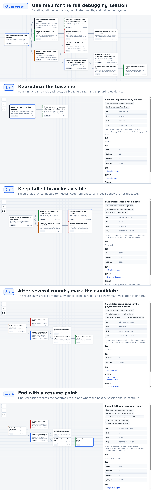

# Debug Route Tracker V1.0

A local-first map of what you tried, why, and what failed.

Stop losing context across long debugging sessions.

Debug Route Tracker 是给 AI 编程和复杂调试用的路线图：记录每次尝试、分支、失败、证据和结论。

它适合 Codex、Claude Code、Cursor 等 AI 辅助编程场景。调试十几轮以后，你仍然可以看清做过什么、为什么改、哪个分支失败了，以及当前路线是否偏离主线目标。

它把每次调试尝试记录到 `debug_route_events.jsonl`，再生成浏览器可直接打开的图形页面、树形后备页面、Graph JSON 和 Markmap Markdown。

## 项目动机

在复杂代码调试中，问题往往不是“没有做改进”，而是做了太多改进后失去路线感：

- 当前到底是在主线目标上推进，还是已经偏到某个临时分支？
- 哪些尝试已经做过，哪些只是候选方案，哪些已经失败或废弃？
- 每次改动对应的配置、日志、指标和源码位置在哪里？
- 当前结果是比基线更好，还是只是换了一个实验窗口后看起来更好？
- 多轮调试之后，如何快速恢复上下文，避免重复试错？

Debug Route Tracker 的目标是把“调试过程”显式记录成一张路线图：主目标、分支路线、实验节点、证据节点和结果结论都在同一份数据里。这样每次继续工作前，可以先确认当前节点属于哪条路线、有没有偏离主线、已有尝试的结果如何。

## 核心能力

- 单一数据源：只手工维护 `debug_route_events.jsonl`，其他页面和图数据都由脚本生成。
- 主线追踪：用父子节点表达主目标、分支路线、具体尝试和结果证据。
- 结果账本：节点可记录 `status`、`metrics`、`code_refs`、`log_refs` 和相关链接。
- 本地静态页面：不需要服务端，直接打开 HTML 即可查看。
- 工作空间隔离：每个源码工作空间都有自己的 tracker 目录，数据不会互相重叠。
- 可恢复上下文：通过图形页面快速查看当前路径、历史尝试、失败分支和下一步方向。
- AI 调试路线记忆：配套 `AGENTS.md`、`CLAUDE.md`、`CODEX.md` 示例，让 AI agent 在调试时自动记录路线。

## 示例案例

这个页面展示一个 12 节点复杂 bug 案例：从 baseline 复现，到失败分支、证据节点、候选修复、最终修复和回归验证。用户看完可以直接理解这个工具解决的是“AI 调试多轮以后上下文丢失”的问题。

案例数据来自 `examples/complex_bug_events.jsonl`，页面只读取生成后的 `examples/complex_bug_data.js`，不会读取或修改你的真实 `debug_route_events.jsonl`。

这张图先给出完整调试路线总览，再从同一条路线拆解：先确认 baseline，再保留失败分支，接着标记候选修复，最后留下可恢复的验证节点。



初始化到具体工作空间后，真实数据页面在：

```text
/path/to/YOUR_WORKSPACE/workspace_version_docs/debug_route_tracker/react_flow_view/index.html
```

## 项目说明

这个工具适合用来管理一个代码工作空间里的调试历史：

- 记录每次尝试的父节点、路线、状态、结论、指标、日志和源码引用。
- 用 `react_flow_view/index.html` 查看主图形页面。
- 用 `index.html` 作为无需任何依赖的后备树形视图。
- 每个工作空间都有自己的 tracker 目录，数据不会互相重叠。

主图形页面是用浏览器原生 HTML/CSS/JavaScript 实现的图形视图。目录名保留为 `react_flow_view`，但当前没有打包或引入 React Flow。

## 安装步骤

克隆或复制本仓库：

```bash
git clone https://github.com/taojianggit/debug_route_tracker.git
cd debug_route_tracker
```

不需要安装 npm 包、pip 包，也不需要构建步骤。把这个仓库保留为通用工具目录，然后给每个源码工作空间初始化一个独立 tracker。

## 依赖

- Python 3.8+：用于 CLI、数据生成和初始化脚本。
- 现代浏览器：用于打开 `react_flow_view/index.html` 和 `index.html`。
- 不需要 npm、pip、dev server、网络访问或构建工具。

## 快速使用

1. 为一个工作空间初始化独立 tracker：

```bash
git clone https://github.com/taojianggit/debug_route_tracker.git
cd debug_route_tracker
./debug-route init /path/to/YOUR_WORKSPACE
```

2. 打开主图形页面：

```text
/path/to/YOUR_WORKSPACE/workspace_version_docs/debug_route_tracker/react_flow_view/index.html
```

3. 在该工作空间 tracker 目录里追加调试节点：

```bash
cd /path/to/YOUR_WORKSPACE/workspace_version_docs/debug_route_tracker
./debug-route add --id trial-YYYYMMDD-name --parent main-debug-objective --title "New trial" --status current --route route-name --summary "Purpose, result, conclusion"
```

## AI Agent 集成

这个项目的卖点不是“静态页面”，而是让 AI 调试不会丢路线。仓库包含三份可复制到工作空间根目录的 agent 指令示例：

- `AGENTS.md`：通用 AI agent 指令。
- `CLAUDE.md`：Claude Code 指令。
- `CODEX.md`：Codex 指令。

核心规则是：AI agent 不需要记录每个 shell 命令，但必须在重要节点写入调试路线，包括 baseline、分支尝试、失败原因、证据、候选修复、最终修复和下一步恢复点。

典型写入方式：

```bash
TRACKER=workspace_version_docs/debug_route_tracker
$TRACKER/debug-route add --tracker "$TRACKER" \
  --id trial-YYYYMMDD-short-name \
  --parent main-debug-objective \
  --title "Trial: concise branch title" \
  --status current \
  --route route-name \
  --summary "Hypothesis, result, conclusion" \
  --code-ref source=src/path/to/file.ext \
  --log-ref run=logs/run-output.log
```

## 页面入口

- `react.html`：12 节点复杂 bug 示例，展示 baseline、失败尝试、证据、候选修复和最终验证。
- `react_flow_view/index.html`：主图形页面，支持拖拽、缩放、MiniMap、过滤、选中路径、子树聚焦和详情面板。
- `index.html`：后备树形视图，可直接用浏览器打开。
- `debug_route_markmap.md`：生成的 Markmap 兼容层级摘要。

## 重新生成数据

```bash
./debug-route regen
```

这会重新生成：

- `debug_route_data.js`
- `debug_route_graph.json`
- `debug_route_markmap.md`

## 添加或修补节点

添加一个新调试节点：

```bash
./debug-route add \
  --id trial-YYYYMMDD-name \
  --parent main-debug-objective \
  --title "New trial title" \
  --status current \
  --route module-or-topic \
  --summary "Hypothesis, result, conclusion" \
  --metric replay_s=120 \
  --code-ref source=../../src/path/to/file.cpp \
  --log-ref run=../../logs/run-output
```

修补已有节点，不重写旧 JSONL 行：

```bash
./debug-route patch \
  --id trial-YYYYMMDD-name \
  --status failed \
  --summary "Updated conclusion"
```

## 在其他工作空间使用

也可以直接运行初始化脚本：

```bash
python3 init_debug_route_tracker.py --target /path/to/workspace/debug_route_tracker
```

或者给指定 tracker 目录重新生成数据：

```bash
./debug-route regen --tracker /path/to/workspace/debug_route_tracker
```

如果把 `debug-route` 单独复制到仓库外部，需要设置：

```bash
export DEBUG_ROUTE_TRACKER_HOME=/path/to/debug_route_tracker
```

## 和 Git / GitHub 的关系

Git 和 GitHub 主要记录代码历史：每次改了什么、在哪个分支、对应哪个 commit、如何回退和合并。

Debug Route Tracker 主要记录调试决策历史：为什么做这个尝试、它属于哪条路线、用了哪个配置和日志、指标结果如何、当前状态是候选、失败、基线还是证据。

核心区别：

```text
Git 记录代码历史。
Debug Route Tracker 记录调试决策历史。
```

两者应该配合使用，而不是互相替代。推荐做法是用 Git branch / commit 固定代码状态，用 tracker 节点记录调试路线、实验结论、日志、指标，并在节点 `links` 中关联 GitHub commit、branch、issue 或 PR。

## TODO

- 增加可选的 Module Layout 和 Timeline Layout。
- 当节点数量足够大时，再增加 Cytoscape.js 全局 review graph。
- 为 `code_refs` 增加可选 codegraph 增强，例如 callers、callees、impact radius 和相关源码文件。
- 增加 Git/GitHub 关联字段或快捷参数，例如 `--commit`、`--branch`、`--issue`、`--pr`，自动写入节点 `links`。
- 增加 Git 状态快照记录，例如当前分支、HEAD commit、dirty 状态和主要改动文件。
- 支持从 GitHub issue / PR / commit URL 生成或补全 tracker 节点，减少重复录入。
- 如果项目接受 npm 开发流程，再考虑真正引入 React Flow。
- 增加更丰富的影响范围高亮，例如反复失败的源码文件、被多次使用的配置和变更模块。

## 第三方工具和版权风险

当前仓库只使用 Python 标准库和浏览器原生 HTML/CSS/JavaScript。

当前没有打包或引入：

- React Flow
- Markmap
- Cytoscape.js
- npm 依赖
- pip 依赖

`debug_route_markmap.md` 只是兼容外部 Markmap 查看器的 Markdown 输出。如果后续真正打包 Markmap、React Flow、Cytoscape.js 或其他开源库，需要补充对应许可证声明，并在发布前确认许可证兼容性。

本项目采用 MIT License，详见 `LICENSE`。
